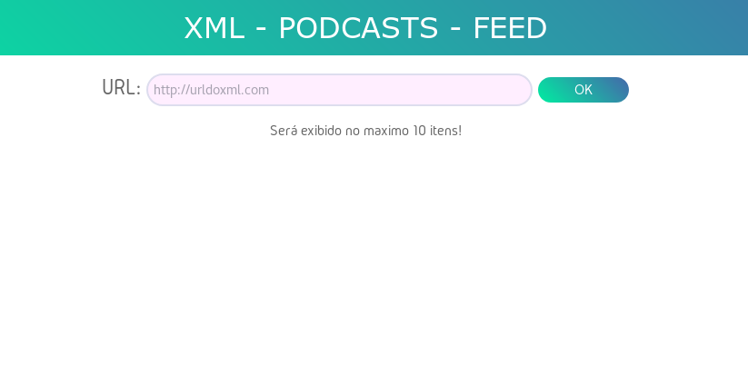

## Manipulação de XML, focado em podcasts

Uma aplicação que exibe no máximo 10 podcasts da url de um feed!

> Coloquei esse limite para a resposta do servidor não demorar muito, em alguns casos



### Passo a passo:

- O Cliente faz uma requisição, com AJAX, mandando a url de um XML
- O servidor recebe a url e faz os seguintes passos, se for caminho feliz, ou seja, sem erros:
  - Baixa o XML, da url passada
  - Converte o XML para Objeto Javascript
  - Filtra o Objeto Javascript, pegando as informações:
    - Titulo do podcast
    - Imagem dos criadores do podcast
    - Titulo de cada item
    - Descrição de cada item
    - Audio de cada item
  - Cria um Objeto com as informações filtradas
  - Passa esse Objeto para um renderizador de HTML
  - Rederiza um HTML com os dados do Objeto
  - Manda o resultado da renderização para o Cliente
- O cliente recebe e adiciona no corpo do HTML
- FIM


#### O que foi usado:

- No _**Cliente**_
  - **HTML5**
  - **CSS**
  - **JavaScript**
  - **AJAX**


- No _**Servidor**_

  - **Node.js**

  - **ejs** (para renderizar o HTML)

  - **xml2js** (parser para xml)

    ​

#### Iniciando o servidor:

É necessário ter o **node.js** ( >= 8.10.0 ) instalado.

Se não tiver, siga o tutorial: [Installing Node.js via package manager](https://nodejs.org/en/download/package-manager/)

Geralmente, o **npm** (node package manager) vem junto.

##### Execute:

1. Instalando as dependencias

   ```npm install```

2. Iniciando o servidor

   ```npm start```


Pronto! Se tudo der certo, o servidor estará rodando na porta 8888.

